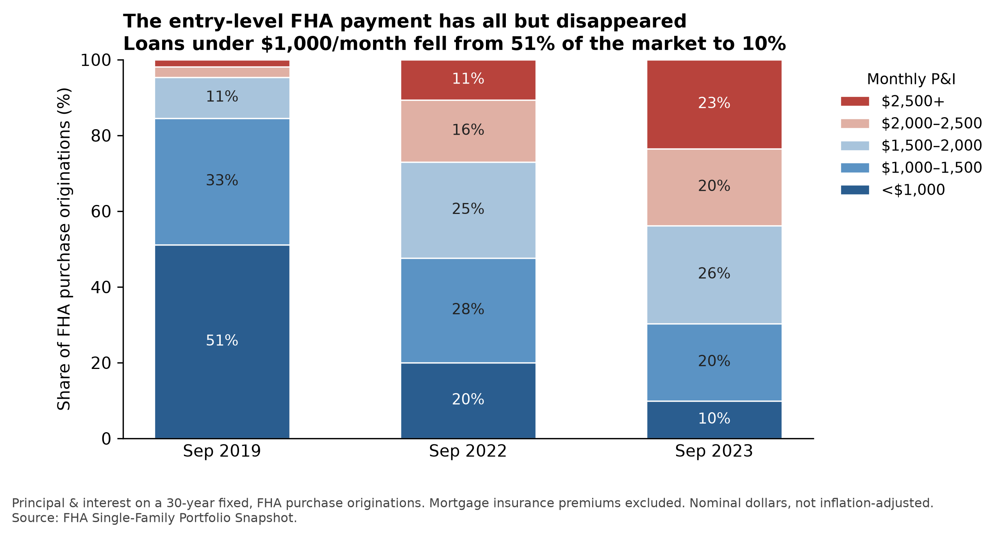
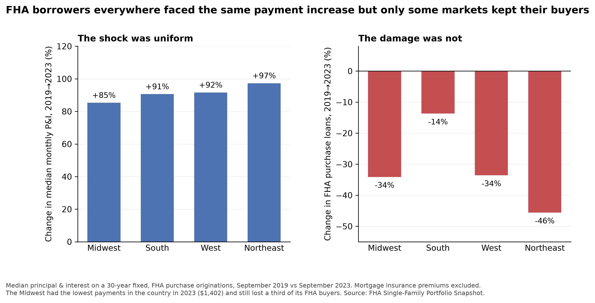

# A National Shock with Local Outcomes
### FHA Purchase Lending, September 2019 - September 2023

Analysis of **171,098 FHA purchase originations** from the FHA Single-Family Portfolio Snapshot.

**Audience:** federal housing policymakers (HUD/FHA leadership, House and Senate housing staff)

> **Research question:** the payment on the median FHA purchase loan rose 89% between 2019 and 2023. Did the markets that lost the most FHA buyers suffer the largest payment increases?
>
> **Answer: no** — and that null result is the finding.

**[Full analysis notebook →](fha_analysis.ipynb)**

---

## The entry-level payment tier collapsed



Loans with principal and interest under $1,000/month fell from **51% to 10%** of the market. Loans above $2,500 rose from 2% to 23%.

| | Sep 2019 | Sep 2023 | Change |
|---|---:|---:|---:|
| Median loan amount | $208,160 | $293,584 | +41% |
| Median note rate | 3.88% | 6.75% | +2.87 pp |
| Median monthly P&I | $989 | $1,872 | **+89%** |
| Purchase originations | 70,291 | 51,614 | −27% |

Loan size rose 41% while the payment rose 89%. **Rates, not prices, did most of the damage.**

---

## The shock was uniform. The damage was not.



| Region | Median P&I 2023 | Payment growth | Volume change |
|---|---:|---:|---:|
| Midwest | **$1,402** | +85% | −34% |
| South | $1,807 | +91% | **−14%** |
| West | $2,532 | +92% | −34% |
| Northeast | $2,025 | +97% | **−46%** |

The Midwest had the **lowest payments in the country** and still lost a third of its FHA buyers. The South, with payments 29% higher, lost less than a seventh. If affordability alone drove outcomes, this ordering would be impossible.

### Variance decomposition

Across 84 metros with ≥200 FHA purchase loans in 2019 — share of cross-metro variation in volume change explained:

| Predictor | R² |
|---|---:|
| Payment growth 2019→2023 | 0.016 |
| Payment level 2023 | 0.071 |
| Census region | **0.430** |
| Region + payment growth | 0.431 |

Payment growth adds **+0.002** once region is known. **The payment shock was the trigger, not the differentiator.**

---

## Repository contents

```
├── fha_analysis.ipynb    # full analysis, EDA through figures
├── README.md
├── data/
│   └── fha_snap_sep.csv  # source data (not committed)
└── figures/
    ├── fig1_uniform_shock_uneven_damage.png
    └── fig2_payment_tier_collapse.png
```

## Reproducing

```bash
pip install pandas numpy matplotlib jupyter
mkdir -p data figures
# place fha_snap_sep.csv in data/
jupyter lab fha_analysis.ipynb
```

Runs top to bottom. No dependencies beyond pandas, numpy, and matplotlib.

## Method notes

- **Payment** is level 30-year principal and interest computed from the recorded note rate and original mortgage amount. Mortgage insurance premiums are excluded; they apply roughly uniformly across cohorts, so including them would shift levels but not any comparison.
- **Dollars are nominal.** Real payment growth is smaller, but cross-market comparison is unaffected.
- **14 of 44 columns were entirely empty** and are dropped in cleaning.
- Metro analysis is restricted to CBSAs with ≥200 purchase loans in 2019 (84 metros) to avoid small-denominator noise. 13.6% of loans are non-metro and are excluded from metro-level results only.

## Limitations

1. FHA loans only: cannot distinguish a fall in FHA's market share from a contraction of the whole market. This is the most important caveat.
2. No borrower income, credit score, or LTV, so composition shifts cannot be ruled out.
3. One month per year: seasonally consistent, but not cycle-adjusted.

## Analytical approach

This notebook deliberately records a **rejected hypothesis**. The initial framing that metros with the largest payment increases lost the most volume was tested, found to explain 1.6% of the variation, and discarded in favor of the regional decomposition.

Given a time-constrained assessment, three secondary threads were checked cheaply and scoped out rather than pursued:

- **Lender concentration** — top-10 share rose 24% - 32%, but HHI remains ~175, far below the 1,500 moderate-concentration threshold, across 1,030 active originators. No story.
- **Rate dispersion** — the P90–P10 spread widened from 1.38 to 1.88 pp, but without FICO or LTV it cannot be separated from legitimate risk-based pricing.
- **Down payment source mix** — moved less than 2 points across all categories.

---

*Prepared for the AEI Housing Center Data Analysis & Coding Assessment.*